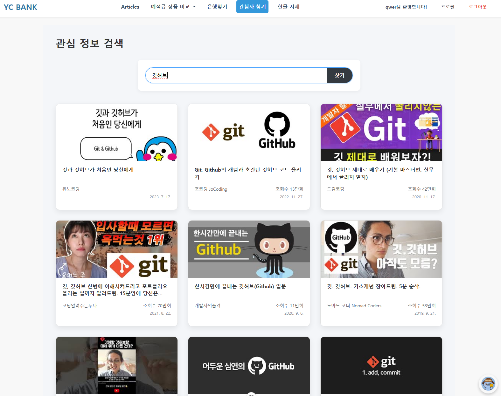

# 🏦 YC BANK - 맞춤형 금융 상품 추천 웹 애플리케이션

> 사용자의 연령, 연봉, 자산 정보를 기반으로 **예·적금 금융 상품**을 추천하는 지능형 웹 플랫폼  
> 다양한 편의 기능과 커뮤니티까지 제공하는 종합 금융 정보 서비스

---

## 📌 프로젝트 개요

YC BANK는  예·적금 상품 추천 웹 애플리케이션입니다.

### 📆 프로젝트 기간 & 팀원 
- 2025년 5월 22일 - 2024년 5월 27일(6일)
- 박선우(팀장), 김태영(팀원)

---

## 🧠 핵심 기술 스택

| 영역 | 기술 |
|------|------|
| **Frontend** | HTML, CSS, JavaScript, Vue.js, Chart.js |
| **Backend** | Django, Django REST Framework |
| **Database** | SQLite |
| **AI & 추천** | OpenAI API |
| **외부 API** | 금융감독원API, OpenAPI, Kakao Maps API, YouTube API |

---

## ⚙️ 시스템 아키텍처

---

### 🎨 설계 목업  

---

### 🗃 ERD  

---

## 🔍 금융 상품 추천 알고리즘

- **데이터 기반 추천**: 사용자 나이, 연봉, 자산 데이터를 입력받아 그룹화
- **AI 활용**: OpenAI API를 활용한 로직 검증 및 보완

---

## 💡 주요 기능 소개

### 1. 메인 페이지
- AI추천서비스

### 2. 회원 관리
- Django User 모델 커스터마이징 (가입 상품 목록 포함)
- 로그인, 회원가입, 로그아웃, 프로필 수정

### 3. 예·적금 상품 조회
- 금융감독원 API 연동 DB 저장
- 필터링 및 상세 페이지 구현
- 관심 상품 등록 및 가입 기능 제공

### 4. 커뮤니티 (게시판)
- 자유 게시판 + 댓글
- 작성자 본인만 수정/삭제 가능
- 날짜별 게시글 필터링

### 5. 편의 기능
- **은행 위치 찾기** (Kakao Maps API)

- **현물 시세 차트** (Chart.js)

- **금융 유튜브 영상 추천** (YouTube API)

---

## 🤖 생성형 AI 기능

- **AI 추천 로직 설계**: OpenAI API로 다양한 추천 모델 실험 및 적용
- **금융 챗봇 기능**: 사용자의 투자 성향에 따라 상품 설명 및 맞춤형 제안

---

## 🗓 프로젝트 작업 일지

### ✅ 2025년 5월 22일
- 요구사항 분석 및 정리
- 콘텐츠 및 DB, 화면 설계
- 기능 단위 업무 분담 완료

### ✅ 2025년 5월 23일
- 회원가입/로그인 기능 구현
- 지도 기반 근처 은행 찾기 기능 구현
- 챗봇 초기 로직 구축
- 인증 UI 설계 및 적용
- 게시판 CRUD 기능 구현

### ✅ 2025년 5월 25일
- 현물 시세 조회 및 차트 시각화 기능 구현
- 예적금 상품 저장용 DB 스키마 구성

### ✅ 2025년 5월 26일
- 상품 검색 및 가입 기능 구현
- 관심 종목 상세 조회 기능 추가
- 게시판 날짜별 필터 기능 개발
- 프로필 페이지 개발

### ✅ 2025년 5월 27일
- AI 기반 맞춤형 금융 상품 추천 기능 구현
- 덤프 데이터 생성
- 전반적인 웹 디자인 리팩토링
- 발표자료(PPT) 작성 완료

---

## 🙌 개발 후기

### 🧑‍💻 박선우

이번 프로젝트를 통해 가장 먼저 느낀 점은 초기 설계의 중요성이었습니다. 저희 팀은 프론트엔드와 백엔드를 완전히 분리하는 방식이 아니라, 기능 단위로 업무를 나누어 진행했기 때문에, 초반 설계가 매우 중요한 요소였습니다. 이에 따라 설계 코드, 일정, 기능, DB, 화면 설계까지 세밀하게 준비해야 했고, 이 과정에 많은 시간을 투자했습니다. 처음에는 다른 팀에 비해 개발 시작이 다소 늦어져 불안감도 있었지만, 탄탄한 설계 덕분에 개발 과정은 오히려 수월하게 진행할 수 있었습니다.

또 하나 크게 느낀 점은 팀원 간의 원활한 의사소통의 중요성입니다. 진행 상황이나 발생한 오류를 자주 공유하고 논의한 덕분에 문제를 빠르게 해결할 수 있었고, 계획도 유동적으로 조정할 수 있어 프로젝트 속도에도 긍정적인 영향을 주었습니다.

이번 프로젝트를 통해 설계와 의사소통의 중요성을 다시 한 번 체감할 수 있었던 점이 가장 큰 수확이었고, 아쉬운 점이 있다면 기획 면에서 차별성이 다소 부족했다는 점입니다. 다음 기회에는 이 부분을 보완해 더 완성도 높은 프로젝트를 만들어보고 싶습니다.

끝으로, 프로젝트에 도움을 주신 모든 분들께 감사드립니다.

### 🧑‍💻 김태영

이번 관통 프로젝트를 진행하면서 처음에는 어떻게 구성을 해야하는지 고민이 많았습니다. 하지만 팀원과
함께 프로젝트를 진행하면서 업무 분담을 자세히 하고 개발을 시작하기 전에 가이드라인 구성을 먼저 하고 가게 되어서 개발을 진행하는 동안에는 큰 문제 없이 무난하게 진행이 되었습니다.

이렇게 진행되는 과정을 거치면서 시간을 좀 더 투자하더라도 초반에 설계를 잘 해야 추후 진행되는 개발에 시간을 투자하는 시간이 줄어들면서 결과적으로 더 빨리 개발이 완료된 다는 것을 실질적으로 체감을 하게 되었습니다.

앞으로 2학기때 프로젝트를 진행하게 되면 이번 프로젝트 처럼 초기 설계 단계에서 시간을 투자하면서 완벽하게 설계를 한 다음에 개발에 착수하는 프로젝트를 진행 하도록 노력해야 할 것 같습니다.

